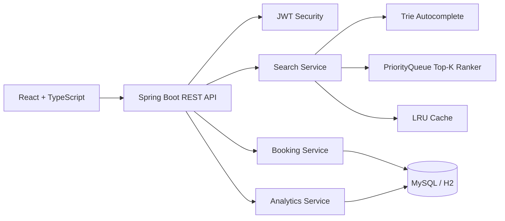

# StayFinder — Smart Hotel Search, Booking & Analytics Platform

StayFinder is a resume-ready, full-stack hospitality technology project built for software engineering and data-focused graduate roles. It combines a production-style Java backend, a polished React frontend, SQL-backed booking workflows, explainable search ranking, caching, analytics, Docker, testing and CI.

## Why this project stands out

- **Real business domain:** hotel discovery, room availability, bookings, reviews and revenue analytics.
- **DSA used meaningfully:** Trie autocomplete, heap-based top-K ranking, HashMap-backed LRU cache and interval-overlap checks.
- **Strong backend engineering:** Spring Boot, REST APIs, JWT authentication, validation, exception handling, layered architecture and unit tests.
- **Database depth:** relational modelling, JPA, SQL constraints, indexes, aggregate analytics and MySQL support.
- **Deployment-ready:** Docker Compose, Nginx, health checks and GitHub Actions.
- **Explainable ranking:** every hotel result includes a score breakdown instead of behaving like a black box.

## Tech stack

| Layer | Technology |
|---|---|
| Frontend | React, TypeScript, Vite, Recharts, Lucide |
| Backend | Java 21, Spring Boot, Spring Security, Spring Data JPA |
| Database | MySQL 8 in Docker; H2 for zero-setup local development |
| Authentication | JWT + BCrypt |
| DevOps | Docker, Docker Compose, Nginx, GitHub Actions |
| Testing | JUnit 5, Spring Boot Test |

## Architecture



## Main features

### Customer experience
- Search by hotel name, city, dates, price, rating and amenities.
- Instant Trie-powered suggestions.
- Heap-ranked results with score explanations.
- Room-level availability and conflict prevention.
- JWT login and registration.
- Booking history and cancellation.
- Verified-user review submission.

### Admin analytics
- Revenue, bookings, occupancy and cancellation KPIs.
- Six-month revenue trend.
- City-wise performance.
- Top-performing properties.

### Engineering features
- Global exception handling.
- DTO-based API contract.
- Input validation.
- Database indexes.
- Custom LRU cache.
- Unit tests for core algorithms.
- Docker health checks.

## Run with Docker — recommended

Prerequisite: Docker Desktop must be running.

```bash
cp .env.example .env
docker compose up --build
```

Open:

- Frontend: `http://localhost:3000`
- Backend API: `http://localhost:8080/api`
- Health endpoint: `http://localhost:8080/api/health`

Demo accounts:

- Admin: `admin@stayfinder.dev` / `Admin@123`
- Customer: `demo@stayfinder.dev` / `Demo@123`

## Run without Docker

### Backend

Install Java 21 and Maven 3.9+.

```bash
cd backend
mvn spring-boot:run
```

The default profile uses an in-memory H2 database.

### Frontend

```bash
cd frontend
npm install
npm run dev
```

Open `http://localhost:5173`.

## Important API endpoints

| Method | Endpoint | Purpose |
|---|---|---|
| POST | `/api/auth/register` | Create account |
| POST | `/api/auth/login` | Login and receive JWT |
| GET | `/api/hotels/search` | Filtered and ranked hotel search |
| GET | `/api/hotels/autocomplete?q=` | Trie-based suggestions |
| GET | `/api/hotels/{id}` | Hotel details and available rooms |
| POST | `/api/bookings` | Create booking |
| GET | `/api/bookings/me` | Logged-in user's bookings |
| PATCH | `/api/bookings/{id}/cancel` | Cancel booking |
| POST | `/api/hotels/{id}/reviews` | Submit review |
| GET | `/api/analytics/overview` | Admin analytics dashboard |

## DSA mapping

| Data structure / algorithm | Where it is used | Complexity |
|---|---|---|
| Trie | Search suggestions | `O(m)` lookup for prefix length `m` |
| Min-heap / PriorityQueue | Keep best `K` hotels without sorting everything | `O(n log K)` |
| HashMap + doubly-linked order | LRU search cache | Average `O(1)` get/put |
| Interval overlap | Prevent double booking | Database-backed overlap check |
| Weighted scoring | Explainable ranking | `O(n)` scoring |

## Resume bullets

- Built a full-stack hotel discovery and booking platform using **Java, Spring Boot, React, TypeScript, MySQL and Docker**, implementing secure JWT authentication and room-level availability checks.
- Designed a **Trie-powered autocomplete**, **heap-based top-K ranking engine** and **LRU cache** to deliver fast, explainable hotel search across multiple filters.
- Developed an analytics dashboard for **revenue, occupancy, cancellations and city-level KPIs**, backed by relational data modelling and aggregate queries.
- Containerised the system with Docker Compose and added automated build/test checks through GitHub Actions.

## Suggested interview demo flow

1. Search for “Jai” and show autocomplete.
2. Filter by pool, rating and budget.
3. Explain the ranking score shown on each card.
4. Open a hotel, choose dates and book a room.
5. Attempt an overlapping booking and show conflict prevention.
6. Open “My Trips”.
7. Login as admin and show the analytics dashboard.
8. Open the algorithm unit tests and architecture diagram.

## Repository structure

```text
stayfinder-project/
├── backend/          Spring Boot API
├── frontend/         React application
├── docs/             API and interview notes
├── .github/workflows CI pipeline
├── docker-compose.yml
└── README.md
```

## Notes for production hardening

For a real production deployment, move secrets to a managed secret store, use managed MySQL, add refresh tokens, rate limiting, distributed caching such as Redis, object storage for images, observability, migrations with Flyway and a payment provider.
