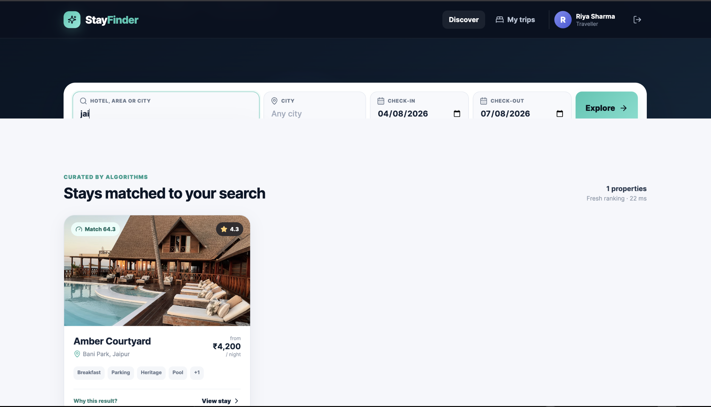
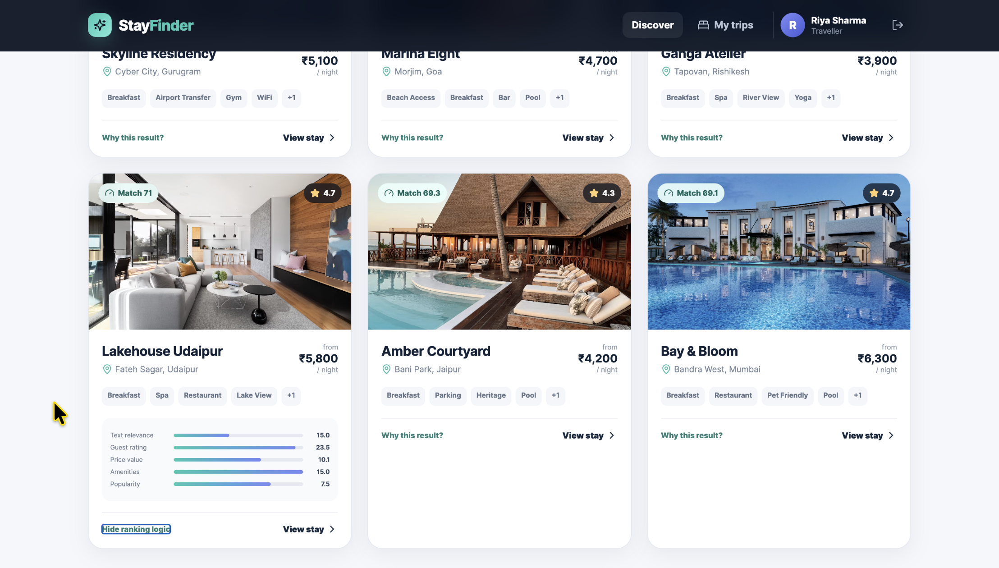
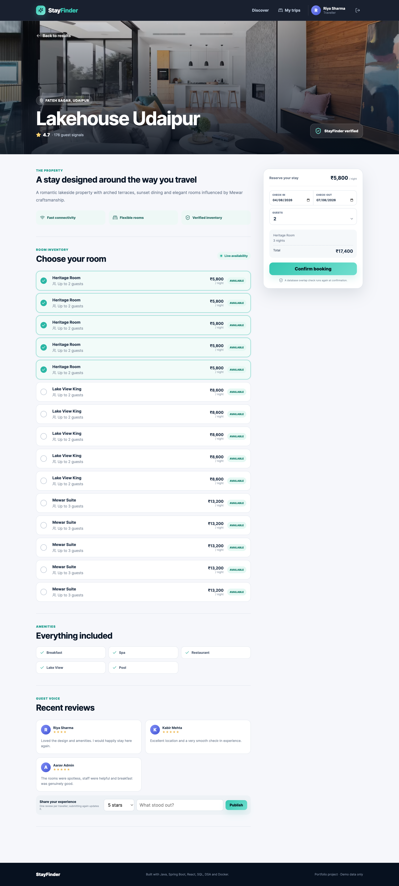

<div align="center">

# 🏨 StayFinder

### Smart Hotel Search, Recommendation & Booking Platform

A production-inspired full-stack hospitality application built with  
**Java, Spring Boot, React, TypeScript, MySQL and Docker**.

<br>


</div>

<p align="center">
  <a href="https://stayfinder-smart-hotel-search.vercel.app/">
    <strong>🌐 Live Demo</strong>
  </a>
  &nbsp;&nbsp;•&nbsp;&nbsp;
  <a href="https://github.com/techy-bhavya/stayfinder-smart-hotel-search">
    <strong>💻 Source Code</strong>
  </a>
</p>

---

## 📖 Overview

**StayFinder** is a full-stack hotel discovery and booking platform that combines real-world hospitality workflows with data structures, search optimisation and explainable hotel ranking.

Users can search for properties, compare recommendations, inspect the reason behind each ranking, view room inventory, check availability, create bookings, publish reviews and manage previous trips.

The application uses a React frontend, a Spring Boot REST API, MySQL persistence and Docker Compose for local multi-container deployment.

---

## ✨ Key Features

- Search hotels by name, city or locality
- Dynamically filter and rank matching properties
- Explain the score behind every recommendation
- View hotel details, amenities, ratings and guest reviews
- Check room inventory and live availability
- Select room categories according to price and guest capacity
- Calculate booking cost using check-in and check-out dates
- Prevent conflicting bookings using date-overlap validation
- Secure authentication using JWT and Spring Security
- Role-based access for customers and administrators
- View booking history through the **My Trips** section
- Submit hotel reviews and ratings
- Responsive user interface for desktop and mobile screens
- Docker-based local deployment
- Continuous integration using GitHub Actions

---

## 📸 Screenshots

### Home Page


---

### Search Results



---

### Explainable Ranking

Users can expand **Why this result?** to understand how the hotel received its match score.



---

### Hotel Details



---

### Booking Confirmation


---

## 🧠 Data Structures and Algorithms

StayFinder is not limited to basic CRUD operations. Its search and booking workflows use meaningful data structures and algorithms.

### Trie

Used for efficient prefix-based hotel, city and locality suggestions.

Typical prefix-search complexity:

```text
O(m)
```

where `m` is the length of the searched prefix.

---

### Heap / Priority Queue

Used to efficiently select the top-ranked hotels from the available search results.

Top-K ranking complexity:

```text
O(n log k)
```

where:

- `n` is the number of matching hotels
- `k` is the number of top results required

---

### LRU Cache

Used to cache recent search results and avoid repeating expensive ranking operations for identical queries.

Primary operations:

```text
Get: O(1)
Put: O(1)
```

---

### HashMap

Used for fast lookup, scoring, grouping and in-memory access during hotel ranking and search processing.

Average lookup complexity:

```text
O(1)
```

---

### Interval Overlap Validation

Used to prevent multiple users from booking the same room for overlapping dates.

Two booking intervals overlap when:

```text
requestedCheckIn < existingCheckOut
AND
requestedCheckOut > existingCheckIn
```

---

### Weighted Ranking Engine

Hotels are scored using multiple factors:

- Text relevance
- Guest rating
- Price value
- Amenities
- Popularity

The calculated score is shown on every hotel card, and its contribution can be inspected through the **Why this result?** feature.

---

## 🛠️ Tech Stack

### Frontend

- React
- TypeScript
- Vite
- React Router
- Recharts
- CSS
- Fetch-based REST API integration

### Backend

- Java 21
- Spring Boot
- Spring Security
- Spring Data JPA
- Hibernate
- JWT authentication
- Bean Validation
- REST APIs

### Database

- MySQL
- Relational data modelling
- Database indexing
- JPA repositories
- Transaction management

### DevOps

- Docker
- Docker Compose
- Nginx
- Git
- GitHub
- GitHub Actions

---

## 🏗️ Architecture

```text
┌──────────────────────────────┐
│      React + TypeScript      │
│          Frontend            │
└──────────────┬───────────────┘
               │
               │ HTTP / REST API
               ▼
┌──────────────────────────────┐
│       Spring Boot API        │
│ Controllers, Services, DTOs  │
└──────────────┬───────────────┘
               │
               │ JPA / Hibernate
               ▼
┌──────────────────────────────┐
│        MySQL Database        │
│ Users, Hotels, Rooms,        │
│ Bookings and Reviews         │
└──────────────────────────────┘
```

The backend follows a layered architecture:

```text
Controller
    │
    ▼
Service
    │
    ▼
Repository
    │
    ▼
Database
```

### Layer Responsibilities

| Layer | Responsibility |
|---|---|
| Controller | Receives HTTP requests and returns API responses |
| Service | Contains application and business logic |
| Repository | Communicates with the database using Spring Data JPA |
| DTO | Transfers validated data between API layers |
| Entity | Represents database tables |
| Security | Handles JWT authentication and authorisation |

---

## 🔄 Core Application Flow

```text
User enters search criteria
          │
          ▼
Search request reaches Spring Boot
          │
          ▼
Hotels are filtered from the database
          │
          ▼
Ranking score is calculated
          │
          ▼
Heap selects top matching properties
          │
          ▼
Results are cached and returned
          │
          ▼
React renders ranked hotel cards
```

Booking flow:

```text
User selects property and dates
          │
          ▼
Available rooms are requested
          │
          ▼
Backend validates date overlap
          │
          ▼
Room availability is rechecked
          │
          ▼
Booking is stored in MySQL
          │
          ▼
Confirmation is returned to the user
```

---

## 📁 Project Structure

```text
stayfinder-smart-hotel-search/
│
├── .github/
│   └── workflows/
│       └── ci.yml
│
├── backend/
│   ├── src/
│   │   ├── main/
│   │   │   ├── java/
│   │   │   └── resources/
│   │   └── test/
│   ├── pom.xml
│   └── Dockerfile
│
├── frontend/
│   ├── src/
│   │   ├── components/
│   │   ├── pages/
│   │   ├── services/
│   │   ├── utils/
│   │   └── types/
│   ├── package.json
│   ├── vite.config.ts
│   ├── nginx.conf
│   └── Dockerfile
│
├── docs/
│   ├── screenshots/
│   │   ├── home.png
│   │   ├── search-results.png
│   │   ├── ranking-explanation.png
│   │   ├── hotel-details.png
│   │   └── booking-page.png
│   ├── API.md
│   └── INTERVIEW_GUIDE.md
│
├── scripts/
├── .env.example
├── .gitignore
├── docker-compose.yml
├── Makefile
└── README.md
```

---

## 🚀 Running the Project Locally

### Prerequisites

Install the following tools:

- Git
- Docker Desktop
- Docker Compose

Java, Node.js and MySQL do not need to be installed separately when running the complete project through Docker.

---

### 1. Clone the Repository

```bash
git clone https://github.com/techy-bhavya/stayfinder-smart-hotel-search.git
cd stayfinder-smart-hotel-search
```

---

### 2. Create the Environment File

For macOS or Linux:

```bash
cp .env.example .env
```

For Windows PowerShell:

```powershell
Copy-Item .env.example .env
```

---

### 3. Start the Application

```bash
docker compose up --build
```

The first build may take a few minutes because Docker downloads the required images and dependencies.

---

### 4. Open the Application

```text
Frontend: http://localhost:3000
Backend:  http://localhost:8080/api
Health:   http://localhost:8080/api/health
```

A successful health response looks similar to:

```json
{
  "service": "stayfinder-api",
  "status": "UP"
}
```

---

### 5. Stop the Application

Press:

```text
Ctrl + C
```

Then run:

```bash
docker compose down
```

To restart the existing containers without rebuilding:

```bash
docker compose up
```

---

## 🔐 Demo Accounts

### Customer Account

```text
Email: demo@stayfinder.dev
Password: Demo@123
```

### Administrator Account

```text
Email: admin@stayfinder.dev
Password: Admin@123
```

> These credentials are intended only for the local demonstration environment.

---

## 🔌 Main API Modules

The backend exposes REST endpoints for:

- Authentication
- Hotel discovery
- Search suggestions
- Hotel ranking
- Room inventory
- Room availability
- Booking creation
- Booking cancellation
- Booking history
- Reviews
- Administrative analytics
- Health monitoring

Detailed endpoint documentation is available in:

```text
docs/API.md
```

---

## 🔒 Security

StayFinder includes:

- Password hashing
- JWT-based authentication
- Protected API routes
- Role-based authorisation
- Request validation
- Centralised exception handling
- Environment-based configuration
- Ignored secret files through `.gitignore`

The actual `.env` file is not committed to the repository.

---

## 🗃️ Main Data Models

The application is organised around the following core entities:

```text
User
Hotel
Room
Booking
Review
```

Important relationships include:

```text
Hotel  1 ──────── * Room
Hotel  1 ──────── * Review
User   1 ──────── * Booking
Room   1 ──────── * Booking
User   1 ──────── * Review
```

---

## 🧪 Testing and Continuous Integration

The repository includes an automated GitHub Actions workflow.

The CI pipeline validates the project whenever code is pushed to GitHub.

It helps verify:

- Backend compilation
- Frontend compilation
- TypeScript validation
- Dependency installation
- Build integrity

The latest workflow status can be viewed in the repository's **Actions** tab.

---

## 💡 Engineering Highlights

- Full-stack layered architecture
- Explainable ranking instead of random recommendation cards
- Top-K hotel selection using a Heap
- Prefix search using a Trie
- Constant-time cache operations through an LRU cache
- Booking conflict prevention using interval-overlap logic
- Secure authentication using JWT
- MySQL-backed persistent storage
- Responsive React user interface
- Multi-container Docker setup
- Nginx-based frontend serving
- Automated GitHub Actions workflow

---

## 📚 Project Documentation

### API Guide

```text
docs/API.md
```

Contains details about the available backend endpoints.

## 🌐 Live Deployment

- **Frontend:** [Open StayFinder](https://stayfinder-smart-hotel-search.vercel.app/)
- **Backend Health:** [Check API Status](https://stayfinder-smart-hotel-search-production.up.railway.app/api/health)
- **Source Code:** [GitHub Repository](https://github.com/techy-bhavya/stayfinder-smart-hotel-search)

The React frontend is deployed on Vercel, while the Spring Boot API and MySQL database are hosted on Railway.

---

## 🔮 Future Improvements

- Redis-based distributed caching
- Interactive maps and nearby attractions
- Online payment gateway integration
- Email booking confirmations
- Personalised hotel recommendations
- Advanced administrative analytics
- OpenAPI and Swagger documentation
- Integration testing
- Load and performance testing
- Booking invoices and QR codes
- Multi-language and multi-currency support

---

## 👨‍💻 Author

**Bhavya Choudhary**

- GitHub: [@techy-bhavya](https://github.com/techy-bhavya)
- Repository: [StayFinder Smart Hotel Search](https://github.com/techy-bhavya/stayfinder-smart-hotel-search)

---

## ⚠️ Disclaimer

StayFinder uses demonstration data and was developed for learning, portfolio presentation and technical interview preparation.

It is not intended to process real payments or production hotel reservations.